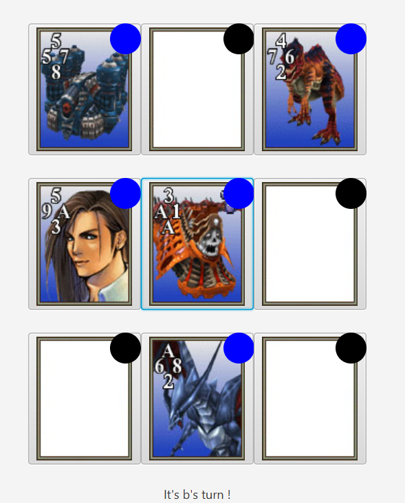
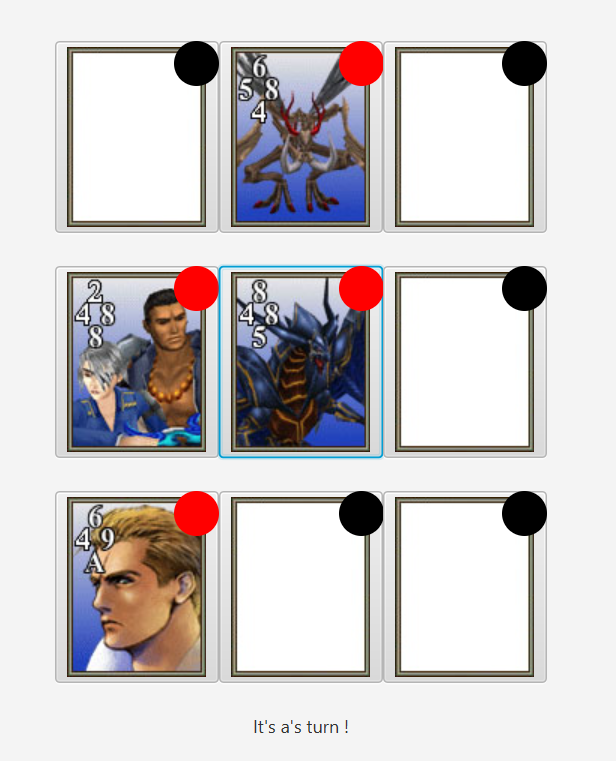
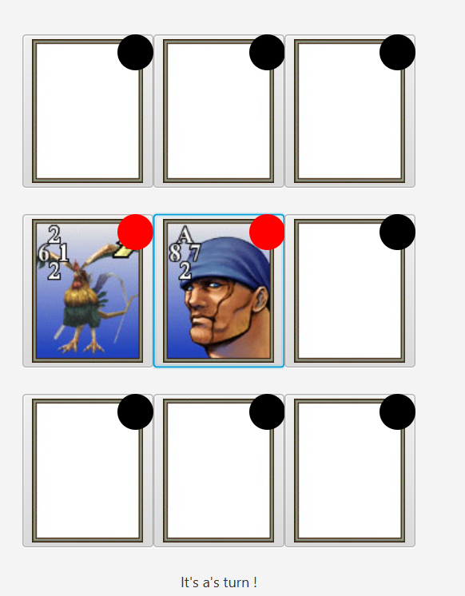
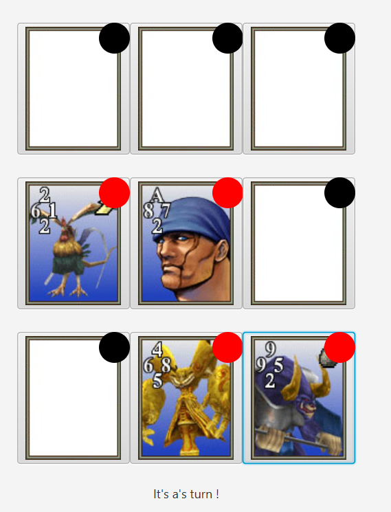
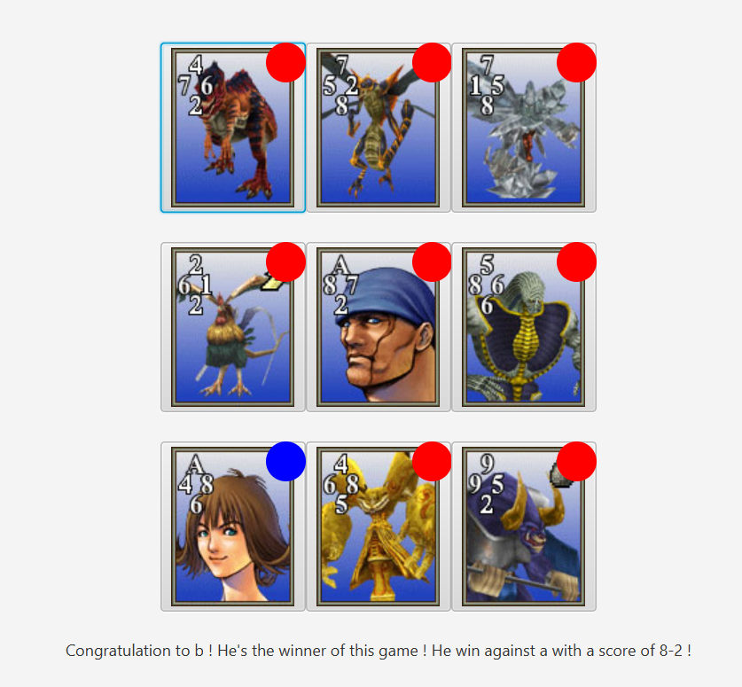

# PLAY CARDS PROJECT

## REQUIREMENTS

You must launch PlayCards folder as a project with IntelliJ Idea

## GROUP MEMBERS

- Yotlan LE CROM (<https://github.com/Yotlan>)
- Endy YU (<https://github.com/endyappel>)
- Florian MONSION (<https://github.com/JayCramboui>)

## PRESENTATION

In this project, you can connect to the main server and you can decide to create a Cards Game Room to play with some people to a Cards Game you have chooseen. 

### CARDS GAMES AVAILABLE

Card games who're available is presented bellow :
- [Triple Triade FF8](#Triple-Triade-FF8)
- [Triple Triade FF14](#triple-triade-ff14-todo) (TODO)
- [Koi Koi Wars](#koi-koi-wars-todo) (TODO)
- *More to come*

### How it work ? 

1. First, you need to launch the server of the PlayCardsApplication by running `StartServer` in path `/PlayCards/src/main/java/fr.playcards/`.
2. Then, you must start the GUI of the first player by running `PlayCardsApplication`, found in same path as the first step. 
3. To conclude for second player, you can run `PlayCardsApplicationLocal`, found in same path as first step.

### How to join a room ?

1. First, user must set a pseudo to join a room. 
2. Then, user can see a choice-box that can choose a game between Triple Triade FF8, Triple Triade FF14 (TODO) and Koi Koi Wars (TODO).
3. When User click on create room, a game room will be created with the game that user has chosen in previous step.
4. Finally, user can join the room with the join's button below. 

## Triple Triade FF8

Initially, the Triple Triade card game is a mini-game of the popular video game Final Fantasy VIII, release in 1999. Lot of people try to create a software to play this card game without playing inside Final Fantasy VIII, and with people ! But these software are not maintened anymore and have lot of concurrency issu. 

This card game need 2 players. Each player have 5 cards, randomly selected following the popular basic rule *Random*. There is a board game with a dimension 3x3 (who're a shared object between 2 players). Each card has 4 values : Upper value, Right value, Down value, Left value. It's a game played round by round, in each round a player can put a card in the board game, this card will be colored with the color of player. After each round, there are some rules will be applied. 

Rules will be applied in this order : 

1. *Same* : flip cards that have same values on 2 or more sides (with opponent's card).

    For example : card A of player1 is 3/1/A/A (above/right/below/left) , card B of player2, below card A, is A/8/2/6 and card C of player2, on the left of card A, is 5/A/3/9. 
    - A (card A below) == A (card B above) 
    - A (card A left) == A (card C right)

    This rule will change the color of card B and card C to player1 color.

2. *Plus* : means that cards values addition equal to the same value, on more than 2 or more sides (with opponent's card) are flipped.

    For example : card A of player1 is 8/8/5/4 (above/right/below/left) , card B of player2, above card A, is 2/3/4/5 and card C of player2, on left of card A, is 2/8/8/4. 
    - 8+4 (card A above,card B below)
    - 4+8 (card A left ,card C right)
    - 8+4 == 4+8
  
    This rule will change the color of card B and card C to player1 color. 
    
3. *Flip* : when a card A is put, and there is a card B of opponent next to A : Card A can be above/left/below/right to B. Card A must compare B with the position of card B relative to card A. When this comparison proves that card A is superior, card B will be colored with the color of opponent. If card A is left to the card B, right value of card A must compare with left value of card B, otherwise we do the opposite. If card A is above card B, below value of card A must compare with above value of card B, otherwise we do the opposite.

   For example : Card A of player1 is A/7/2/8 (above/right/below/left) and Card B of player2 is 2/1/2/6. If card A is right to card B : 8>1 , card A is superior than card B. The color of card B will be colored to player1 color. 

4. *Combo* : Cards flip using *Same*, *Plus* or *Flip* on adjacent cards in *Combo*.

To win, a majority of the total ten cards played (including the one card not played) must be of the player's card color.

## Triple Triade FF14 (TODO)

## Koi Koi Wars (TODO)

## Reference :
- Triple Triad FF8 Rules : https://finalfantasy.fandom.com/wiki/Triple_Triad_(Final_Fantasy_VIII)
